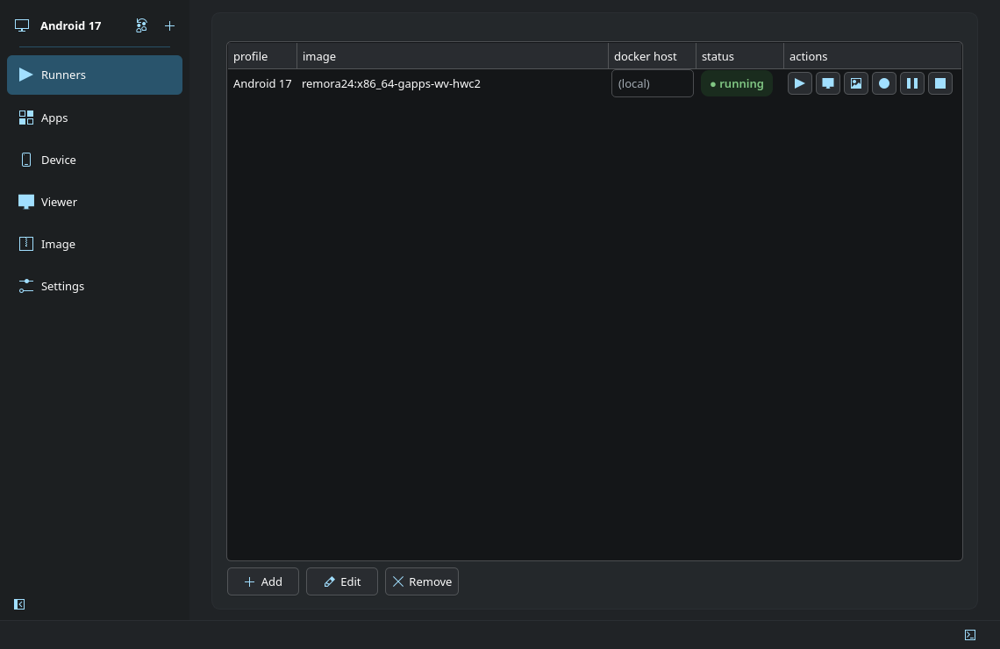

# Remora

A desktop control plane for Android in Docker: one place to compose the image, deploy it and
mirror it — *with every knob actually exposed.*

Remora is **configure-first**: compose your Android image à-la-carte, pick **where** to run it
(this machine, or any docker host over ssh), check the target is ready, then **deploy + connect**
— with a real staged-progress checklist and captured errors instead of a 200-line shell alias.



Written in **C++20 / Qt 6** — a headless CLI and a QtWidgets workspace over one shared, unit-tested core.

---

## Highlights

- **Real NVIDIA acceleration.** Android renders on the proprietary NVIDIA driver: ANGLE → Vulkan →
  Venus → a vtest render server on the host → your GPU. One command (`remora venus-build`) builds
  and installs the host half, and deploys turn it on automatically. Measured at 3760×1992, frame
  times stay at 5 ms from p50 to p99 with 1 ms of GPU time — the same as at 720p — and zero jank.
  Intel and AMD render nodes work directly, and a GPU-less host falls back to SwiftShader.
- **Its own mirror, end to end.** A Remora agent is baked into the image as an init service, and
  a Qt/FFmpeg client talks to it over Remora's own wire protocol: video, audio, input, clipboard,
  desktop-mode displays and app listing. Frames can go straight from Remora's own hwcomposer to a
  hardware encoder on the host GPU, and the client decodes on NVDEC or VA-API. The mirror runs in
  its own systemd scope, so it outlives the workspace.
- **Hardware video inside Android.** A VA-API Codec2 component in the image decodes AVC, HEVC, VP9
  and AV1 and encodes AVC and HEVC on the GPU; on NVIDIA hosts decoding can be handed to the
  host. Widevine L3 is available for DRM apps.
- **Android apps on your desktop.** Every installed app gets a launcher entry with its real icon,
  grouped per profile, and opens in a window of its own (`remora app`), alongside a desktop-mode
  display, a picture-in-picture mirror, and sleep/wake that freezes the whole device and resumes
  it in about a second — automatically when no window is open, if you like.
- **Build exactly the Android you want.** Android 16 or 17 (LineageOS 23 / 24), built from source
  with the features you pick: Google apps or microG, arm64 app translation, Magisk root, Play
  integrity spoofing, a host camera, a host microphone, sensors, CPU-tuned builds. No kernel
  module is needed for Android 17: shared memory runs on memfd.
- **Run it anywhere.** The same deployment runs on this machine or on any docker host over ssh,
  and several instances can run side by side, each with its own data.

---

## What it does

- **Compose the image** — pick **Android 16 or 17** (LineageOS 23 / 24), then toggle each build
  feature à-la-carte, shown at its *honest status* (GApps `OK`, ARM translation `CAVEAT`,
  container-compat `MANDATORY`). Your selection resolves **live** to an image tag, and Remora builds
  that image from source when you don't have it yet. Full catalog:
  **[docs/FEATURES.md](docs/FEATURES.md)**.
- **Pick a deploy target** — `bare` (local docker) or `remote` (any docker host over ssh). Both
  reach a real GPU: the host's render node directly, or NVIDIA via a Venus/vtest render server.
- **Check readiness** — a read-only, per-target probe tells you exactly what's missing (docker
  group, render node, ssh reachability, …) with remedies.
- **Deploy + connect** — runs the proven bring-up chain (`preflight → ensure-image → host-prereqs →
  provision → boot-wait → netfix → connect`), streams per-step progress + captured stderr, and
  launches an external **mirror** window that survives Remora exiting. **Reconnect** attaches to an
  already-running instance; **Stop** tears the target down.
- **Mirror it** — `remora mirror` is an in-house Qt/FFmpeg client, and the device half is a Remora
  **agent baked into the image** (an init service, no per-session push): video, audio, input,
  clipboard, desktop-mode displays and app listing over Remora's own wire protocol. See
  **[docs/MIRROR_AGENT.md](docs/MIRROR_AGENT.md)**.

---

## Requirements

**Build:** a C++20 compiler, **CMake ≥ 3.20**, **Qt 6** (`Core`, `Widgets`, `Test`, `Network`,
`DBus`, `OpenGLWidgets`, `Multimedia`, `WebEngineWidgets`), FFmpeg's development libraries
(`libavcodec`, `libavformat`, `libavutil`, `libswscale`, `libswresample`) and FFmpeg's NVIDIA
codec headers (`ffnvcodec` — headers only; the mirror loads the driver at runtime, so no NVIDIA
GPU is needed to build). A C compiler (`cc`) is used to build the vendored native helpers from
source at deploy time.

Gentoo:

```sh
sudo emerge -av dev-qt/qtbase:6 dev-qt/qtmultimedia:6 dev-qt/qtwebengine:6 \
    dev-build/cmake media-video/ffmpeg media-libs/nv-codec-headers dev-util/android-tools
```

Arch:

```sh
sudo pacman -S qt6-base qt6-multimedia qt6-webengine cmake ffmpeg ffnvcodec-headers android-tools
```

Debian/Ubuntu:

```sh
sudo apt install build-essential cmake qt6-base-dev qt6-multimedia-dev qt6-webengine-dev \
    libgl1-mesa-dev libavcodec-dev libavformat-dev libavutil-dev libswscale-dev \
    libswresample-dev libffmpeg-nvenc-dev adb
```

**Runtime tools** (on this machine, and on the docker host for `remote`): `docker` and
`android-tools` (adb).

**Host prerequisites to actually run Android in a container** (Remora *probes* these read-only; it
does not install them — see `remora check`): a usable DRM render node and `docker` group membership.
Android 17 needs no kernel module; an Android 16 image additionally needs the IBT-fixed
`ashmem_linux.ko`. For NVIDIA acceleration, the Venus render server
(`remora venus-build`, see `vendor/host-prereqs/venus-nvidia/`). Details in
[docs/FEATURES.md](docs/FEATURES.md).

**Building the Android image from source** needs two more host settings, and both fail in ways that
point at the wrong thing:

```sh
# soong opens a lot of files; too low and it dies with "newosproc", which is NOT an OOM
sudo sysctl -w vm.max_map_count=1048576

# systemd-oomd kills the build container at exit 137 and logs to the JOURNAL, not dmesg —
# so `dmesg | grep oom-kill` shows nothing while your builds keep dying
systemctl is-active systemd-oomd && journalctl -u systemd-oomd --since -1h
```

Raise `SwapUsedLimit` in `/etc/systemd/oomd.conf`, or set `ManagedOOMPreference=avoid` on the
slice the build runs in. Remora's build preflight warns about both before it starts.

---

## Build

```sh
cmake -B build -DCMAKE_BUILD_TYPE=Release
cmake --build build
```

This produces a single `build/remora` binary (CLI + `gui` subcommand) and the test executables.

---

## Launch

**GUI** — the config workspace:

```sh
./build/remora gui
```

**CLI** — everything the GUI does, headless (great over ssh):

```sh
./build/remora <command>
```

| command | what it does |
|---|---|
| `remora check [--backend bare\|remote] [--ssh-host user@host]` | per-target deploy readiness — what's missing + how to fix |
| `remora plan [--backend …]` | dry-run: print the resolved `docker run` + mirror command vectors |
| `remora status [--backend …]` | read-only live state (JSON) of the backend + host capabilities |
| `remora up [<profile>]` | deploy + connect for real (staged chain, launches the mirror) |
| `remora reconnect [--backend …]` | attach to an already-running instance (adb + mirror only, no bring-up) |
| `remora build --source [<profile>]` | full AOSP source build of the profile's image — the same chain the GUI runs |
| `remora app <profile> <pkg>` | launch one Android app in its own window |
| `remora shell` / `logcat` / `install` / `shot` | adb conveniences against the profile's device |
| `remora gui` | the QtWidgets config workspace |

`remora` with no arguments lists every command (sleep/wake, systemd service, app-menu integration,
diagnostics bundle, APK transfer between profiles, …).

Config is stored per-instance in `~/.config/remorarc` (standard INI; hand-editable, layered
`[Defaults]` < `[Instance-<name>]`).

### Typical flow

1. `remora check` → confirm the target is READY.
2. `remora gui` → pick the Android version, tick the image features you want, choose the target, tune
   runtime/mirror.
3. **Deploy & Connect** (or `remora up`) → watch the checklist, get a mirror window.

---

## Layout

| path | role |
|---|---|
| `src/core/` | **pure** domain (Qt Core only, no Widgets, no subprocess): config model, resolver, golden-tested command-builders, status parsers, the à-la-carte **feature + gating** engine, per-target **readiness** prereqs, custom-image **recipe** generator |
| `src/engine/` | execution: an injectable `Spawner` (QProcess/ssh), the staged chain, the `bare` / `remote` deployers, per-target mutual exclusion, and the `connect` orchestrator (spawner is injectable → fully testable offline) |
| `src/store/` | `remorarc` config persistence (QSettings INI) |
| `src/ui/` | the **QtWidgets** config workspace + worker `QThread`s (`MainWindow`, `Workers`, `App`) |
| `src/mirror/` | the mirror client (`remora mirror`): FFmpeg decode, audio, input, Remora's wire protocol |
| `src/main.cpp` | the CLI dispatcher + `gui` subcommand |
| `agent/` | the in-image mirror agent (Java, baked into the image by the `mirror_agent` feature) |
| `vendor/` | container/host scripts, native `.c` helpers built at deploy time, and the Android source-build tree (`device/remora`, `vendor/remora`, the c2-va codec, patch series, feature wiring). Third-party payloads are fetched, not committed — see `vendor/PAYLOADS.md` |
| `tests/` | offline Qt Test suites: golden argv vectors, parsers (against real captured fixtures), gating, readiness, and the backend chains (with a `FakeSpawner`) |

## Testing

```sh
ctest --test-dir build
```

Eight suites, green with **no hardware**: the subprocess/ssh layer is injectable, so nothing touches
Docker or a device.

## More

- **[docs/FEATURES.md](docs/FEATURES.md)** — the à-la-carte catalog (build-time vs runtime, defaults,
  deps, status), with each entry's honest status and what it actually delivers.
- **[docs/MIRROR_AGENT.md](docs/MIRROR_AGENT.md)** — the device half: what the in-image agent does,
  why it needs no reflection, and the wire protocol it speaks.

### Licence

Remora is **GPL v3** (see [LICENSE](LICENSE)). It builds on AOSP, LineageOS, Qt and FFmpeg —
[NOTICE](NOTICE) records that work and, importantly, explains when an image you build is *not*
redistributable: enabling Google Apps, Widevine or the ARM native-bridge means the result is
yours to run, not yours to share.

### Not built (deferred)

- **Prebuilt image distribution** — building from source works end to end; a published image
  mirror does not exist yet. [docs/IMAGE_MIRROR.md](docs/IMAGE_MIRROR.md) records what each tag
  would carry and what that means for redistribution.
- The **Android companion app** (a phone client) — future.
